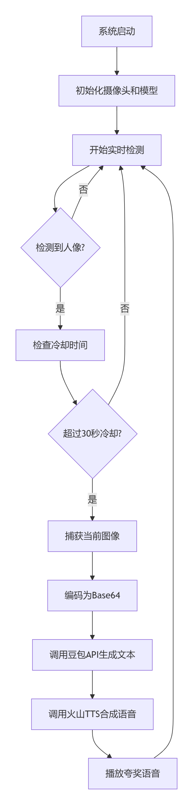

# 夸夸镜：会夸人的AI智能镜，让日常穿搭充满温暖惊喜

## 邂逅你的专属时尚顾问

在这个注重形象表达的时代，每个人都渴望获得真诚的穿衣反馈。**「镜中知己」** 应运而生——这是一面能够看懂你的穿搭、读懂你的气质，并给予温暖夸奖的智能魔镜。

基于树莓派5的强大性能，我们打造了这个充满人情味的AI伴侣。它不仅是镜子，更是懂得欣赏你的时尚知己。

## 为什么你需要这面会说话的镜子？

### 告别穿衣焦虑

- 每天早上站在镜前，不再独自纠结“这样穿好看吗”
- 获得即时、专业的穿搭评价，提升出门自信
- AI用温暖的语言肯定你的审美选择

### 技术赋能生活美学

- 计算机视觉精准识别人像，捕捉穿搭细节
- 大语言模型生成个性化夸奖，每次都有新惊喜
- 流式语音合成，让夸奖声情并茂

## 系统特性

| 特性     | 描述                       |
|--------|--------------------------|
| 实时人像检测 | 使用OpenCV进行面部检测，实时显示检测画面  |
| 智能穿衣夸奖 | 调用豆包API基于用户穿衣照片生成个性化夸奖文本 |
| 语音实时播报 | 通过火山引擎TTS将文本转换为语音并流式播放   |
| 防误触机制  | 设置检测冷却时间，避免连续触发          |
| 多线程处理  | 音频播放与主检测循环分离，确保系统响应性     |

## 硬件要求

**必要组件：**

- 树莓派5
- 摄像头模块
- 耳机（扬声器）

**可选组件：**

- 显示器（用于实时查看检测画面）

## 使用
下载`fashionMirror.zip`

安装所需库`setup.sh`

配置摄像头，参照<https://www.nkym.top/posts/raspberry-imx219/>

运行

    source mirror_env/bin/activate
    python fashionMirrorMain.py

## 代码架构说明

### 1. 导入模块和初始化设置

导入必要的Python库，包括图像处理、网络请求、音频播放等模块  
配置日志系统，用于程序运行时的信息记录和错误追踪

### 2.图像采集模块

- 图像采集模块负责从树莓派摄像头获取高质量的图像数据。
- 基于picamera2库开发
- 实现图像的水平翻转和垂直翻转功能，确保摄像头画面与实际情况保持一致。
- 图像采集过程采用异步非阻塞方式，主检测循环不会因为图像采集而出现卡顿。
- 异常处理机制，当摄像头出现连接故障或硬件异常时，系统能够自动重连或降级处理，保证系统的稳定运行。

### 3.人像检测模块

人像检测模块是系统的触发条件判断核心，基于`OpenCV`实现。

`capture_image()`捕获图像

### 4.prompt

`build_prompt()`

- 预设提示词
- 加入当前时间`get_time()`
- 加入当前定位（调用api通过当前ip地址获取，`get_location()`）
- 加入对人物心情的识别（使用DeepFace库，`emotion_recognition()`）
- 和当前天气相结合（调用api，`get_current_weather()`）

### 4.智能文本生成模块

`call_doubao_api()`基于豆包多模态大语言模型，能够同时处理图像和文本信息。

- 模块构建了专业的穿衣夸奖提示词模板，引导模型从颜色搭配、服装风格、个人气质等多个维度进行分析和评价。提示词设计考虑了语言表达的生动性和情感温度，确保生成的文本既专业又亲切。
- API调用采用异步非阻塞方式，避免主线程被长时间阻塞。模块实现了完善的错误处理机制，包括网络超时、API限流、服务异常等多种情况的应对策略。当主要API服务不可用时，系统会自动切换到本地备用夸奖库，保证基本功能的可用性。备用夸奖库包含多个经过精心设计的夸奖模板，覆盖不同风格的穿衣搭配场景。

### 6.文字生成语音
`call_volcano_tts()`

- 调用火山引擎API
- 流式传输，有效缩短等待时间

### 7.流式音频播放器 

`StreamAudioPlayer`

- **队列管理**：使用双端队列存储音频数据块，实现先进先出播放
- **异步播放**：独立线程处理音频播放，不阻塞主检测循环
- **资源管理**：自动管理`Pygame`的初始化和释放

## 改进

- 提示词进一步多元化，给用户更好的体验
- 加入扬声器
- 加入语音识别功能，与用户时时对话  
  ……
